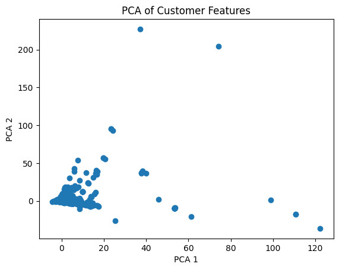
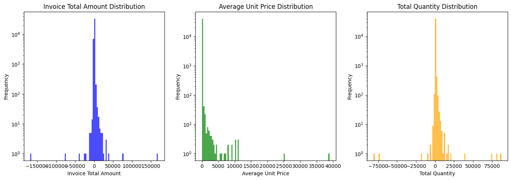
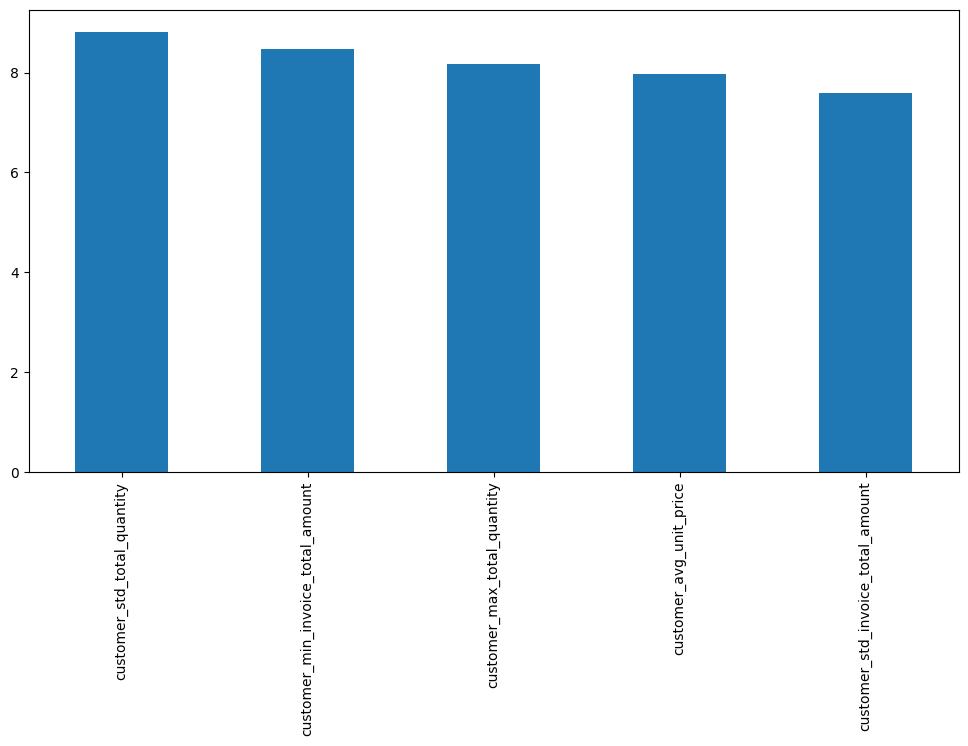
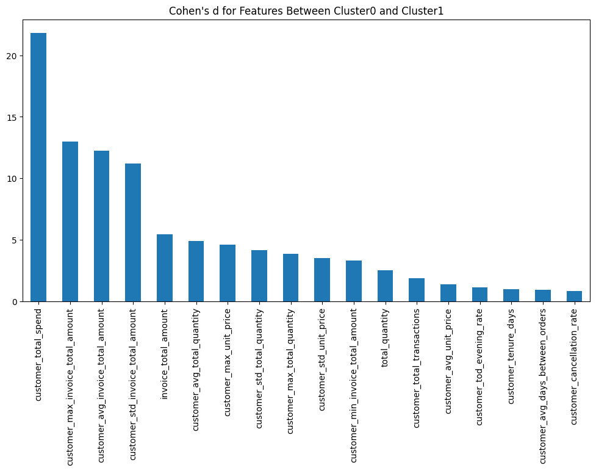
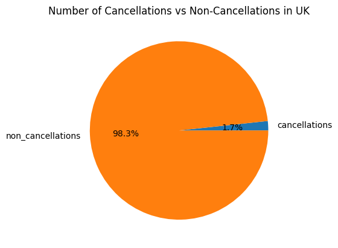

# Discovering Unusual Customer Purchasing Behavior

Project Proposition
Simon S.

# Abstract

- Investigates unusual customer purchasing behavior in UK online retail transactions
- Invoice-level dataset: each transaction's own features + aggregated customer-level behavior
- Goal: discover/characterize behavioral segments, then find transactions & customers that don't fit any of them
- Not a predictive-modelling exercise; clustering is a means, not the end
- Main axes of interest: cancellation behavior and order total

# Motivation: Business Value

- Identify high-value customers
- Identify segments associated with frequent cancellations
- Detect emerging changes in purchasing patterns
- Supports retention, marketing, and operational decisions

# The Dataset

- `online_retail_II.csv` (Kaggle) - transaction log, Dec 2009 - Dec 2011
- ~1.07M line-item rows, 43 countries
- UK-only: 94.7% of all transactions; other countries too sparse for safe inference
- ~1/4 of UK rows are guest purchases (no Customer ID) - dropped
- After filtering: ~741,000 transaction rows -> ~40,500 invoices from ~5,400 customers

# Unit of Analysis & Scope

- Unit of analysis: the individual invoice
- Described by its own transaction-level features + its customer's aggregated behavior
- A customer's routine invoices can cluster normally while a few of their invoices stand out as outliers
- Out of scope: regression on cancellation probability, basket prediction, clustering as an end in itself

# Objective

- Identify and characterize purchasing behavior that differs substantially from the major segments
- Trace those outliers back to the customers who produced them
- Example: if 3 well-defined clusters emerge - which transactions/customers fit none of them?

# Related Work

- Customer Segmentation & Retention Strategy (Kaggle) - segments as end product for retention
- Online Retail Cohort Analysis (Kaggle, same dataset) - descriptive cohorts/trends, not segmentation+outliers
- Enhanced RFM / RFMT (Kaggle) - adds Inter-Purchase-Time to RFM; segmentation is the end goal there
- Recommendation Systems (Kaggle) - association rules & collaborative filtering, different question entirely
- This project differs: segmentation is a baseline, not the deliverable - the deliverable is what doesn't fit

# Proposed Work: Feature Engineering

- Filter to UK, drop guest transactions
- Build customer-level features:
  - Timing: day of week, hour, avg. shopping trips per month
  - Spending: avg/min/max/std of transaction totals
  - Product: avg/min/max/std of items purchased, most frequent products
  - Cancellations: % of cancelled transactions
- Join customer-level features back onto invoice-level records
- Feasibility: ~50 engineered features, ~40,500 invoices, ~5,400 customers

# Proposed Work: Analysis Flow

- Explore segmentation using engineered behavioral features
- Characterize the common patterns found in each segment
- Identify transactions/customers whose behavior differs significantly from the majority or from any segment
- Particular focus: spending, purchase composition, cancellation behavior

# Evaluation: Clustering

- Baseline: KMeans (quick, cheap, first impression - cannot produce outliers)
- Working model: DBSCAN (produces outliers - the "working horse" of this research)
- Two distance metrics evaluated: euclidean and cosine
  - DBSCAN supports cosine natively; "cosine KMeans" approximated via L2-normalization + euclidean KMeans
- Evaluated on: silhouette score (direction, not verdict), stability under hyper-parameter changes, interpretability
- Target: stable, 2-3 interpretable clusters, manageable/interpretable outliers

# Evaluation: Characterizing Differences

- Question: how does cluster A differ from cluster B? How do outliers differ from inliers?
- Raw mean differences aren't comparable across features on different scales
- Solution: Cohen's d - standardized mean difference, comparable across features
- Take the top 5-10 features with |Cohen's d| > 0.8 to characterize/define each population

# PCA: No Easy Shortcut

- PCA fitted to retain 95% of variance
- First 2 principal components explain only ~25% of total variance
- No obvious low-dimensional cluster structure - full feature space needed for clustering

# Model Selection: KMeans Baseline

- Distance metric mattered: euclidean vs. cosine, both tested
- Euclidean on standardized features: best k=3, silhouette = 0.486
- Cosine on L2-normalized features: best k=5, silhouette = 0.161
- Euclidean clearly stronger - cosine KMeans dropped from further analysis

# DBSCAN: Parameter Selection

- `eps` and `min_samples` swept systematically (k-distance plot + stability sweeps)
- `min_samples = 23`: start of a stable region where silhouette/noise behavior stop swinging
- `eps = 9.0`: chosen within that stable region for the best silhouette and an interpretable noise count
- Cosine-metric DBSCAN also tried, but unstable (silhouette negative, noise count swings from 0 to 33k+) - dropped

# Final Model: Locked DBSCAN Result

- **Metric:** euclidean &nbsp; **eps:** 9.0 &nbsp; **min_samples:** 23
- **Clusters found:** 2
- **Noise points (outliers):** 134
- **Silhouette score:** 0.65

# Who Are the Outliers?

- 134 outlier invoices trace back to only **41 distinct customers**
- Only **13** of those 41 also appear in the main clusters
- Most outlier customers are a **separate population** - not occasional lapses by otherwise-typical customers

# An Early Hint: Bulk Orders

- Spotted during feature engineering, before any clustering: a long tail of very large quantities (25K+ items per invoice)
- Suggested a mix of regular shoppers and business/reseller accounts - foreshadowing the outlier finding below

# Outliers vs. Clusters: What Makes Them Different

- Largest effect sizes are all **variability** measures: std. total quantity, std. invoice amount, max quantity
- Plus one cancellation signal: extreme negative minimum invoice total
- Label: **high-volume, high-volatility wholesale transactions**

# Cluster 0 vs. Cluster 1: What Splits Them

- Single dominant driver: `customer_total_spend` - about 20 standard deviations apart
- Cluster 0 avg. total spend: **13,158**
- Cluster 1 avg. total spend: **598,215**
- Label: Cluster 1 = **high total spend** customers

# Cancellations, in Context

- Only 1.7% of UK transactions are cancellations
- Rare, but part of what defines the outlier profile above (extreme negative invoice minimums)

# Conclusions

- DBSCAN flagged 134 outlier invoices from 41 customers, falling into two profiles: **high-volume wholesale accounts** and **high-value cancellation/adjustment records**
- Distinguishing features: `customer_std_total_quantity`, `customer_min_invoice_total_amount`, `customer_max_total_quantity`, `customer_avg_unit_price`, `customer_std_invoice_total_amount`
- These outlier customers mostly do **not** have normal invoices in the main clusters - a genuinely separate population
- A meaningful 2-cluster split also emerged, driven by total spend
- Answers the original question: unusual behavior is concentrated in a small, identifiable customer population - not scattered noise across otherwise-typical customers

# References

- Full reference list in the project proposition document (`project_proposition_draft.md`, Section 8)
- Covers: PCA (Jolliffe 2002), KMeans (MacQueen 1967), DBSCAN (Ester et al. 1996; Schubert et al. 2017),
  silhouette score & DBSCAN docs (scikit-learn), Cohen's d (Cohen 1988), explainable anomaly detection (Li et al. 2023)

# AI Acknowledgement

- This slide deck condenses the author's own approved project proposition draft into slide format
- AI assistance (Claude Code) was used to draft the condensed slide wording and the pandoc conversion workflow
- Full log, prompts, and adaptation notes: `ai_disclosure.md`, entry dated 2026-07-20
